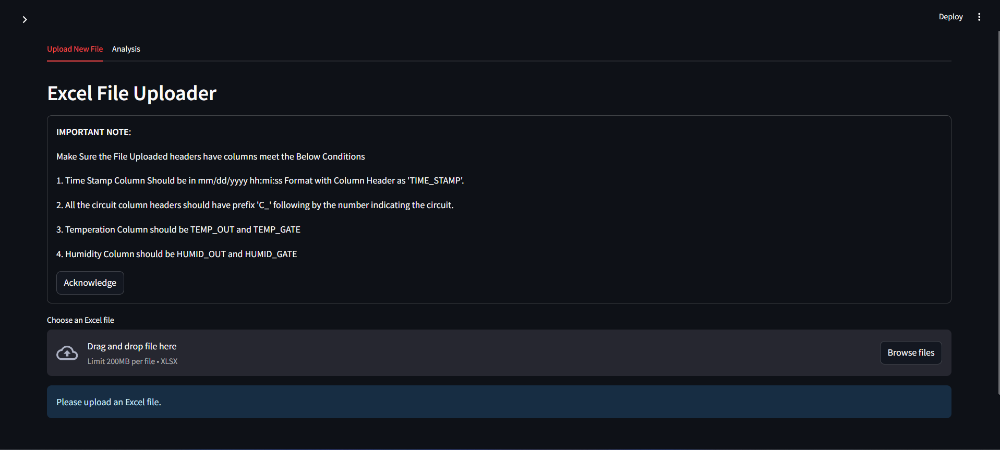
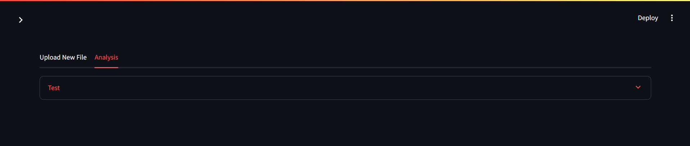
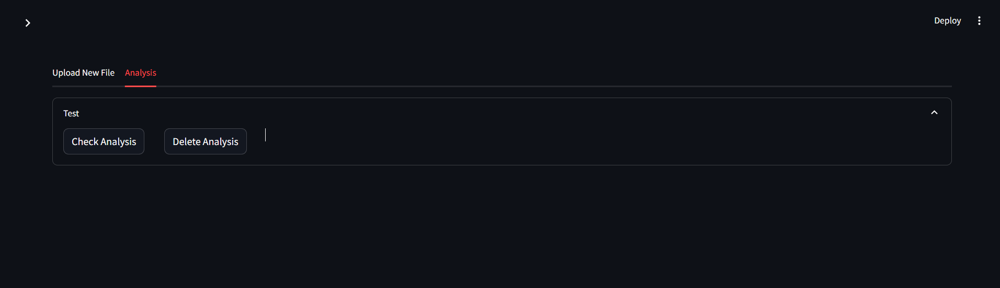
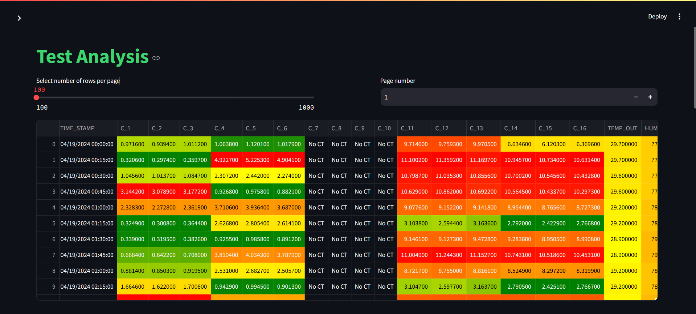
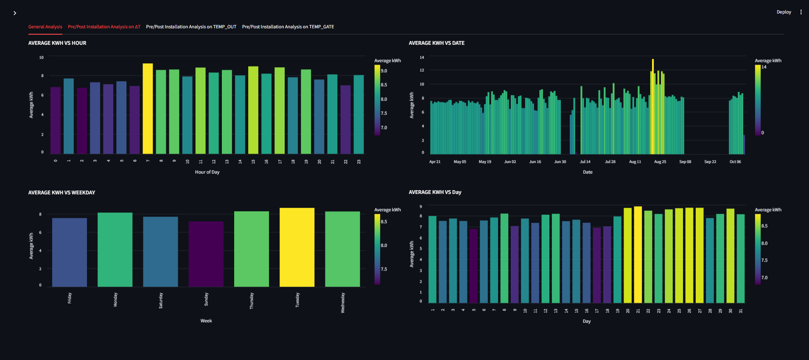

# Energy Efficiency Dashboard

This project provides an interactive analysis dashboard for comparing energy efficiency between different systems before and after installation.

## Features
- General analysis of energy consumption patterns (kWh) across various time periods like Hour of Day, Weekday, Date, and Day.
- Pre/Post Installation Analysis on ∆T (Temperature Difference), TEMP_OUT (Outdoor Temperature), and TEMP_GATE (Gate Temperature).
- Customizable filters for temperature ranges to see energy consumption trends for Pre/Post Installation.
- Visualization of savings in energy consumption through clear, interactive Altair charts.

## Analysis Overview

The dashboard is divided into the following tabs for in-depth analysis:

### 1. General Analysis
- **Average kWh vs Hour of Day**: Shows the mean energy consumption per hour.
- **Average kWh vs Weekday**: Displays energy consumption based on the day of the week.
- **Average kWh vs Date**: Provides a detailed breakdown by calendar date.
- **Average kWh vs Day**: Displays the day-wise consumption trend.

### 2. Pre/Post Installation Analysis on ∆T
- Custom temperature range slider for ∆T to view pre/post installation energy consumption differences.
- Interactive charts showing average kWh consumption trends across the selected ∆T range.
- Summary of energy savings before and after installation.

### 3. Pre/Post Installation Analysis on TEMP_OUT
- Similar analysis is available for outdoor temperature (TEMP_OUT).
- The slider allows setting specific temperature ranges to observe trends pre/post installation.

### 4. Pre/Post Installation Analysis on TEMP_GATE
- Analysis based on gate temperature with a customizable range.

## Technology Stack
- **Streamlit**: For building the interactive dashboard.
- **Altair**: For interactive data visualization.
- **Pandas**: For data manipulation and analysis.
- **Python**: For backend logic and computations.

## How to Use
1. Clone the repository.
2. Install the required dependencies via pip:
```
pip install -r requirements.txt
```
3. Run the Streamlit app using `streamlit run main.py`.
4. The dashboard will launch in your browser, where you can interact with the data and visualizations.

## Customization
You can modify the input data to analyze different systems or temperature ranges. Simply update the data files and adjust the filtering and grouping logic within the `show_input_values()` and `df_filtered` transformations.

## Code Snippets
### Installing dependencies
Run the following command to install the necessary Python packages:
```
pip install -r requirements.txt
```

### Running the dashboard
Once the requirements are installed, you can launch the dashboard with:
```
streamlit run main.py
```

Main Screen : You can upload a folloing the Instructions mentioned and then fill in the requested details.


Analysis : Once the File is uploaded.It will be shown in the Analysis Tab.


Click on Check Analysis button to view the analysis.


The visualization is present in the Below Images

